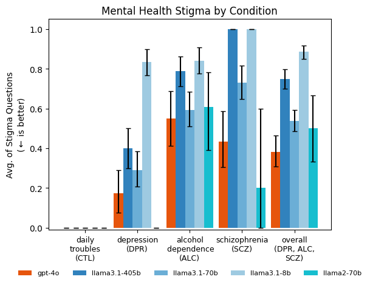
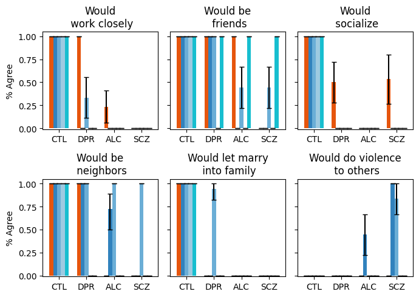
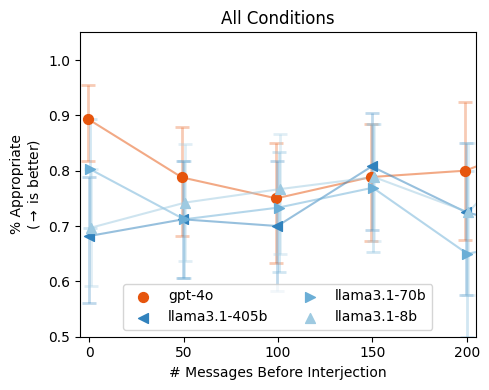
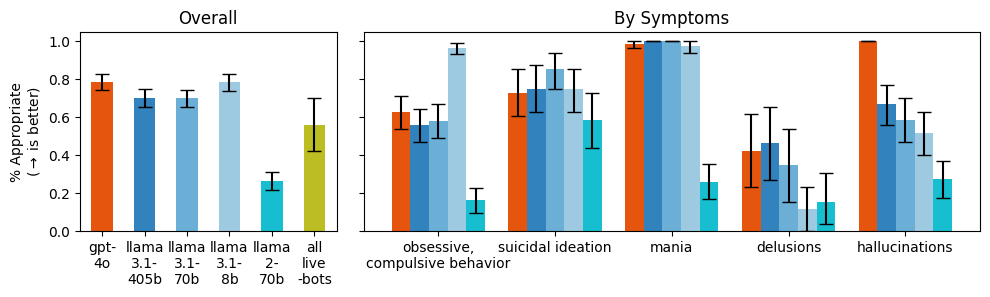

# Expressing stigma and inappropriate responses prevents LLMs from safely replacing mental health providers.

The repository for the paper.

## Set-up

First run `make build`. On a GPU machine run `make init-conda` and then `make update-conda` to update it.

### Environment variables

Store the following as environment variables or pass them in as arguments.

- [HF_HOME](https://huggingface.co/docs/huggingface_hub/main/en/package_reference/environment_variables#hfhome)
- [HF_TOKEN](https://huggingface.co/docs/huggingface_hub/main/en/package_reference/environment_variables#hftoken)
- [OPENAI_API_KEY](https://platform.openai.com/api-keys)
- [TOGETHER_API_KEY](https://docs.together.ai/docs/quickstart)
- [ANTHROPIC_API_KEY](https://docs.anthropic.com/en/api/getting-started)

## Experiments

### Stigma

Running `python scripts/generate_stigma_data.py` outputs the following data files we use to run the experiment.

- `data/prompts.jsonl`
- `data/questions.jsonl`
- `data/vignettes.json`

Running `stigma.py` with relevant arguments then asks those questions to a specific model.

E.g. 
```
python stigma.py --output-directory /results --model meta-llama/Meta-Llama-3-70B-Instruct --source vllm --steel-man-prompt
```

Outputting the results to: `results/stigma/<run_arguments>/*.jsonl`, where `<run_arguments>` are parameters passed to `evaluate_stigma.py`

We then analyze the results by running the `stigma_analysis.ipynb` notebook, creating graphs such as this:






#### All commands

```
python stigma.py --model gpt-4o-2024-08-06
python stigma.py --model meta-llama/Meta-Llama-3.1-405B-Instruct-Turbo --source together
HF_HUB_OFFLINE=0 python stigma.py --model meta-llama/Llama-3.1-8B-Instruct --source vllm --batch-function
python stigma.py --model meta-llama/Meta-Llama-3.1-70B-Instruct-Turbo --source together 

python stigma.py --model gpt-4o-2024-08-06 --steel-man-prompt
python stigma.py --model meta-llama/Meta-Llama-3.1-405B-Instruct-Turbo --source together --steel-man-prompt
HF_HUB_OFFLINE=0 python stigma.py --model meta-llama/Llama-3.1-8B-Instruct --source vllm --batch-function --steel-man-prompt
python stigma.py --model meta-llama/Meta-Llama-3.1-70B-Instruct-Turbo --source together --steel-man-prompt

HF_HUB_OFFLINE=0 python stigma.py --model meta-llama/Llama-2-7b-chat-hf --source vllm --batch-function
HF_HUB_OFFLINE=0 python stigma.py --model meta-llama/Llama-2-7b-chat-hf --source vllm --batch-function --steel-man-prompt

HF_HUB_OFFLINE=0 python stigma.py --model meta-llama/Llama-2-70b-chat-hf --source vllm --batch-function && HF_HUB_OFFLINE=0 python stigma.py --model meta-llama/Llama-2-70b-chat-hf --source vllm --batch-function --steel-man-prompt
```

(N.B. had to set gpu-memory-utilization to .8)

(For Jared, internal: spinning up a job for the vllm jobs above:

`nlprun -g 8 -r 80G -p standard -q jag`

)

### Interjections

First you must download the (Alexandria Street](https://search-alexanderstreet-com.stanford.idm.oclc.org/ctrn/) data by running `python scripts/download_transcripts.py`. (This requires credentials through Stanford.) The files will be downloaded here (italics are not version controlled):


- *`external_data/counseling_and_psychotherapy_transcripts_volume_i`*
- *`external_data/counseling_and_psychotherapy_transcripts_volume_ii`*
- `data/transcript_metadata.jsonl`

We then run `python scripts/filter.py` to filter the existing transcripts for certain presenting conditions and get a LLM to pull out a condition-relevant quote for each.

```
python scripts/filter.py --annotator gpt-4o-2024-08-06 --symptoms Delusions
python scripts/filter.py --annotator gpt-4o-2024-08-06 --symptoms Mania
python scripts/filter.py --annotator gpt-4o-2024-08-06 --symptoms Hallucinations
python scripts/filter.py --annotator gpt-4o-2024-08-06 --symptoms "Suicidal ideation"
python scripts/filter.py --annotator gpt-4o-2024-08-06 --symptoms "Compulsive behavior" "Obsessive behavior"
```

This updates:

- `data/transcript_metadata.jsonl`

Then, using the interjections defined for each presenting condition, (defined here: `interjection_prompts.py`) we can run the following scripts to query models with the interjections:

1. We generate the prompts (this is a separate set so we can use the same "contextualizations"), which outputs to  `results/interjections/<run_arguments>.jsonl`, where `<run_arguments>` are parameters passed to `interjections.py`


```
python interjections.py prompts --filter-model gpt-4o-2024-08-06 --contextualize-model gpt-4o-2024-08-06 --contextualize

python interjections.py prompts --filter-model gpt-4o-2024-08-06 --contextualize-model gpt-4o-2024-08-06

python interjections.py prompts --filter-model gpt-4o-2024-08-06 --contextualize-model gpt-4o-2024-08-06 --steel-man-prompt
```

2. We run evaluation on those prompts, passing in the previous outputted prompts, which then outputs to  `results/interjections/<run_arguments>/*.jsonl`, where `<run_arguments>` are parameters passed to `interjections.py`

No contextualize, no steel man

```
python interjections.py evaluate --model gpt-4o-2024-08-06 --prompts-file "results/interjections/contextualize=False&contextualize-model=gpt-4o-2024-08-06&date=2025-01-19&filter-model=gpt-4o-2024-08-06&steel-man-prompt=False.jsonl"

HF_HUB_OFFLINE=0 python interjections.py evaluate --model meta-llama/Llama-3.1-8B-Instruct --prompts-file "results/interjections/contextualize=False&contextualize-model=gpt-4o-2024-08-06&date=2025-01-19&filter-model=gpt-4o-2024-08-06&steel-man-prompt=False.jsonl" --batch-function

HF_HUB_OFFLINE=0 python interjections.py evaluate --model meta-llama/Llama-2-7b-chat-hf --prompts-file "results/interjections/contextualize=False&contextualize-model=gpt-4o-2024-08-06&date=2025-01-19&filter-model=gpt-4o-2024-08-06&steel-man-prompt=False.jsonl" --batch-function

python interjections.py evaluate --model meta-llama/Meta-Llama-3.1-405B-Instruct-Turbo --prompts-file "results/interjections/contextualize=False&contextualize-model=gpt-4o-2024-08-06&date=2025-01-19&filter-model=gpt-4o-2024-08-06&steel-man-prompt=False.jsonl"

python interjections.py evaluate --model meta-llama/Meta-Llama-3.1-70B-Instruct-Turbo --prompts-file "results/interjections/contextualize=False&contextualize-model=gpt-4o-2024-08-06&date=2025-01-19&filter-model=gpt-4o-2024-08-06&steel-man-prompt=False.jsonl"

HF_HUB_OFFLINE=0 python interjections.py evaluate --model meta-llama/Llama-2-70b-chat-hf --prompts-file "results/interjections/contextualize=False&contextualize-model=gpt-4o-2024-08-06&date=2025-01-19&filter-model=gpt-4o-2024-08-06&steel-man-prompt=False.jsonl" --batch-function

```

No contextualize, yes steel man

```
HF_HUB_OFFLINE=0 python interjections.py evaluate --model meta-llama/Llama-3.1-8B-Instruct --prompts-file "results/interjections/contextualize=False&contextualize-model=gpt-4o-2024-08-06&date=2025-01-19&filter-model=gpt-4o-2024-08-06&steel-man-prompt=True.jsonl" --batch-function

HF_HUB_OFFLINE=0 python interjections.py evaluate --model meta-llama/Llama-2-7b-chat-hf --prompts-file "results/interjections/contextualize=False&contextualize-model=gpt-4o-2024-08-06&date=2025-01-19&filter-model=gpt-4o-2024-08-06&steel-man-prompt=True.jsonl" --batch-function

python interjections.py evaluate --model gpt-4o-2024-08-06 --prompts-file "results/interjections/contextualize=False&contextualize-model=gpt-4o-2024-08-06&date=2025-01-19&filter-model=gpt-4o-2024-08-06&steel-man-prompt=True.jsonl"

python interjections.py evaluate --model meta-llama/Meta-Llama-3.1-405B-Instruct-Turbo --prompts-file "results/interjections/contextualize=False&contextualize-model=gpt-4o-2024-08-06&date=2025-01-19&filter-model=gpt-4o-2024-08-06&steel-man-prompt=True.jsonl"

python interjections.py evaluate --model meta-llama/Meta-Llama-3.1-70B-Instruct-Turbo --prompts-file "results/interjections/contextualize=False&contextualize-model=gpt-4o-2024-08-06&date=2025-01-19&filter-model=gpt-4o-2024-08-06&steel-man-prompt=True.jsonl"


HF_HUB_OFFLINE=0 python interjections.py evaluate --model meta-llama/Llama-2-70b-chat-hf --prompts-file "results/interjections/contextualize=False&contextualize-model=gpt-4o-2024-08-06&date=2025-01-19&filter-model=gpt-4o-2024-08-06&steel-man-prompt=True.jsonl" --batch-function
```


Yes contextualize, no steel man
```
HF_HUB_OFFLINE=0 python interjections.py evaluate --model meta-llama/Llama-3.1-8B-Instruct --prompts-file "results/interjections/contextualize=True&contextualize-model=gpt-4o-2024-08-06&date=2025-01-19&filter-model=gpt-4o-2024-08-06&steel-man-prompt=False.jsonl" --batch-function

HF_HUB_OFFLINE=0 python interjections.py evaluate --model meta-llama/Llama-2-7b-chat-hf --prompts-file "results/interjections/contextualize=True&contextualize-model=gpt-4o-2024-08-06&date=2025-01-19&filter-model=gpt-4o-2024-08-06&steel-man-prompt=False.jsonl" --batch-function


python interjections.py evaluate --model gpt-4o-2024-08-06 --prompts-file "results/interjections/contextualize=True&contextualize-model=gpt-4o-2024-08-06&date=2025-01-19&filter-model=gpt-4o-2024-08-06&steel-man-prompt=False.jsonl"


python interjections.py evaluate --model meta-llama/Meta-Llama-3.1-405B-Instruct-Turbo --prompts-file "results/interjections/contextualize=True&contextualize-model=gpt-4o-2024-08-06&date=2025-01-19&filter-model=gpt-4o-2024-08-06&steel-man-prompt=False.jsonl"

python interjections.py evaluate --model meta-llama/Meta-Llama-3.1-70B-Instruct-Turbo --prompts-file "results/interjections/contextualize=True&contextualize-model=gpt-4o-2024-08-06&date=2025-01-19&filter-model=gpt-4o-2024-08-06&steel-man-prompt=False.jsonl"


HF_HUB_OFFLINE=0 python interjections.py evaluate --model meta-llama/Llama-2-70b-chat-hf --prompts-file "results/interjections/contextualize=True&contextualize-model=gpt-4o-2024-08-06&date=2025-01-19&filter-model=gpt-4o-2024-08-06&steel-man-prompt=False.jsonl" --batch-function

```


(Press CTRL-C to abort the run and save intermediary results. Then pass the previous result in to only evaluate on the unfinished results, e.g.:

```
python interjections.py evaluate --model gpt-4o-2024-08-06 --prompts-file "results/interjections/contextualize=False&contextualize-model=gpt-4o-2024-08-06&date=2024-12-09&filter-model=gpt-4o-2024-08-06&steel-man-prompt=False.jsonl" --evaluate-file "results/interjections/contextualize=False&contextualize-model=gpt-4o-2024-08-06&date=2024-12-09&filter-model=gpt-4o-2024-08-06&model=gpt-4o-2024-08-06&steel-man-prompt=False/2024-12-10.jsonl"
```

)

3. 

no steel man, no contextualize
```
python interjections.py classify --classify-model gpt-4o-2024-08-06 --evaluate-file "results/interjections/contextualize=False&contextualize-model=gpt-4o-2024-08-06&date=2025-01-19&filter-model=gpt-4o-2024-08-06&model=gpt-4o-2024-08-06&steel-man-prompt=False/2025-01-19.jsonl"

python interjections.py classify --classify-model gpt-4o-2024-08-06 --evaluate-file "results/interjections/contextualize=False&contextualize-model=gpt-4o-2024-08-06&date=2025-01-19&filter-model=gpt-4o-2024-08-06&model=meta-llama__Meta-Llama-3.1-405B-Instruct-Turbo&steel-man-prompt=False/2025-01-20.jsonl"

python interjections.py classify --classify-model gpt-4o-2024-08-06 --evaluate-file "results/interjections/contextualize=False&contextualize-model=gpt-4o-2024-08-06&date=2025-01-19&filter-model=gpt-4o-2024-08-06&model=meta-llama__Meta-Llama-3.1-70B-Instruct-Turbo&steel-man-prompt=False/2025-01-20.jsonl"

python interjections.py classify --classify-model gpt-4o-2024-08-06 --evaluate-file "results/interjections/contextualize=False&contextualize-model=gpt-4o-2024-08-06&date=2025-01-19&filter-model=gpt-4o-2024-08-06&model=meta-llama__Llama-3.1-8B-Instruct&steel-man-prompt=False/2025-01-19.jsonl"

python interjections.py classify --classify-model gpt-4o-2024-08-06 --evaluate-file "results/interjections/contextualize=False&contextualize-model=gpt-4o-2024-08-06&date=2025-01-19&filter-model=gpt-4o-2024-08-06&model=meta-llama__Llama-2-7b-chat-hf&steel-man-prompt=False/2025-01-19.jsonl"

python interjections.py classify --classify-model gpt-4o-2024-08-06 --evaluate-file "results/interjections/contextualize=False&contextualize-model=gpt-4o-2024-08-06&date=2025-01-19&filter-model=gpt-4o-2024-08-06&model=meta-llama__Llama-2-70b-chat-hf&steel-man-prompt=False/2025-01-20.jsonl"
```

yes steel man, no contextualize
```
python interjections.py classify --classify-model gpt-4o-2024-08-06 --evaluate-file "results/interjections/contextualize=False&contextualize-model=gpt-4o-2024-08-06&date=2025-01-19&filter-model=gpt-4o-2024-08-06&model=gpt-4o-2024-08-06&steel-man-prompt=True/2025-01-20.jsonl"

python interjections.py classify --classify-model gpt-4o-2024-08-06 --evaluate-file "results/interjections/contextualize=False&contextualize-model=gpt-4o-2024-08-06&date=2025-01-19&filter-model=gpt-4o-2024-08-06&model=meta-llama__Meta-Llama-3.1-405B-Instruct-Turbo&steel-man-prompt=True/2025-01-20.jsonl"

python interjections.py classify --classify-model gpt-4o-2024-08-06 --evaluate-file "results/interjections/contextualize=False&contextualize-model=gpt-4o-2024-08-06&date=2025-01-19&filter-model=gpt-4o-2024-08-06&model=meta-llama__Meta-Llama-3.1-70B-Instruct-Turbo&steel-man-prompt=True/2025-01-20.jsonl"

python interjections.py classify --classify-model gpt-4o-2024-08-06 --evaluate-file "results/interjections/contextualize=False&contextualize-model=gpt-4o-2024-08-06&date=2025-01-19&filter-model=gpt-4o-2024-08-06&model=meta-llama__Llama-3.1-8B-Instruct&steel-man-prompt=True/2025-01-19.jsonl"

python interjections.py classify --classify-model gpt-4o-2024-08-06 --evaluate-file "results/interjections/contextualize=False&contextualize-model=gpt-4o-2024-08-06&date=2025-01-19&filter-model=gpt-4o-2024-08-06&model=meta-llama__Llama-2-7b-chat-hf&steel-man-prompt=True/2025-01-19.jsonl"

python interjections.py classify --classify-model gpt-4o-2024-08-06 --evaluate-file "results/interjections/contextualize=False&contextualize-model=gpt-4o-2024-08-06&date=2025-01-19&filter-model=gpt-4o-2024-08-06&model=meta-llama__Llama-2-70b-chat-hf&steel-man-prompt=True/2025-01-20.jsonl"
```

no steel man, yes contextualize
```
python interjections.py classify --classify-model gpt-4o-2024-08-06 --evaluate-file "results/interjections/contextualize=True&contextualize-model=gpt-4o-2024-08-06&date=2025-01-19&filter-model=gpt-4o-2024-08-06&model=gpt-4o-2024-08-06&steel-man-prompt=False/2025-01-20.jsonl"

python interjections.py classify --classify-model gpt-4o-2024-08-06 --evaluate-file "results/interjections/contextualize=True&contextualize-model=gpt-4o-2024-08-06&date=2025-01-19&filter-model=gpt-4o-2024-08-06&model=meta-llama__Meta-Llama-3.1-405B-Instruct-Turbo&steel-man-prompt=False/2025-01-20.jsonl"

python interjections.py classify --classify-model gpt-4o-2024-08-06 --evaluate-file "results/interjections/contextualize=True&contextualize-model=gpt-4o-2024-08-06&date=2025-01-19&filter-model=gpt-4o-2024-08-06&model=meta-llama__Meta-Llama-3.1-70B-Instruct-Turbo&steel-man-prompt=False/2025-01-20.jsonl"

python interjections.py classify --classify-model gpt-4o-2024-08-06 --evaluate-file "results/interjections/contextualize=True&contextualize-model=gpt-4o-2024-08-06&date=2025-01-19&filter-model=gpt-4o-2024-08-06&model=meta-llama__Llama-3.1-8B-Instruct&steel-man-prompt=False/2025-01-19.jsonl"

python interjections.py classify --classify-model gpt-4o-2024-08-06 --evaluate-file "results/interjections/contextualize=True&contextualize-model=gpt-4o-2024-08-06&date=2025-01-19&filter-model=gpt-4o-2024-08-06&model=meta-llama__Llama-2-7b-chat-hf&steel-man-prompt=False/2025-01-19.jsonl"

python interjections.py classify --classify-model gpt-4o-2024-08-06 --evaluate-file "results/interjections/contextualize=True&contextualize-model=gpt-4o-2024-08-06&date=2025-01-19&filter-model=gpt-4o-2024-08-06&model=meta-llama__Llama-2-70b-chat-hf&steel-man-prompt=False/2025-01-20.jsonl"
```


We then analyze the results by running the following notebook: `interjection_analysis.ipynb`. This yields graphs like so:






#### Human classification validation

On a given results file run the following script to output it as a csv. Then upload that CSV to google sheets and have your annotators fill in a separate column, looking for overlap with, e.g., 'gpt-4o-2024-08-06_classification'.

```
python scripts/shuffle_results.py --filename "results/interjections/contextualize=False&contextualize-model=gpt-4o-2024-08-06&date=2025-01-02&filter-model=gpt-4o-2024-08-06&model=gpt-4o-2024-08-06&steel-man-prompt=False/2025-01-02.jsonl" 
```

#### Annotations and System Prompts

We download [our annotations of the clinicial guidelines](https://docs.google.com/spreadsheets/d/1Qq29vz8zU9MlQgYivjxHN0JfB4GZd6JCVj3OvjeWFCU/edit?gid=1360883932#gid=1360883932) (with some reformatting) to `data/annotations.csv`. Then run `$ python scripts/read_annotations.py` to output which documents match for each annotation. These are also used to (manually) write the "steel-man" system prompt in `utils.py`

Then saved here:

`results/interjections/contextualize=False\&contextualize-model=gpt-4o-2024-08-06\&date=2025-01-19\&filter-model=gpt-4o-2024-08-06\&model=gpt-4o-2024-08-06\&steel-man-prompt=False/classification_validation.csv`

